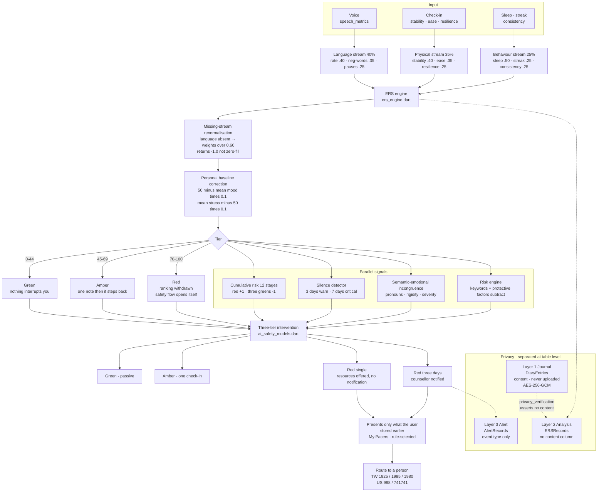

# lii

**A proactive, tiered AI emotional health app.**

*The worse it gets, the less lii says.*

**[▶ Live demo](https://gorgeous-hamster-ccf26c.netlify.app/#/home)** | [English](README.md) | [繁體中文](README.zh-TW.md)

> The web build runs in a browser with no install. AI conversation needs your own
> OpenAI-compatible API key, entered in Settings; without one the app runs in
> offline mode with demo replies, and every other feature works normally.
>
> **First load is slow — a known limitation.** Flutter web renders through
> CanvasKit, which must download several megabytes of engine before the first
> pixel is painted. Measured over 7 days (n = 66 unique visitors across Japan,
> the US and Taiwan, on varied networks), p75 FCP exceeds 3 seconds, with longer
> one-off peaks on slow connections. Once loaded, interaction is stable and the
> layout does not shift (CLS is good). Native iOS and Android builds do not have
> this problem.
>
> The web build also lacks hardware-backed key protection — the strongest
> guarantees are on native, as the app's own About page states.

---

## Read this first — two versions live in this repository

This repository was renamed to `lii` in August 2026 (formerly `PsyGuard-AI`); the full development history of both phases remains in the commit log. The application directory `psyguard_ai_app/` is left unchanged as a trace of v1.

| | v1 — PsyGuard AI | v2 — lii |
|---|---|---|
| Period | Apr – May 2026 | 10 Jul 2026 – present |
| Authorship | Four-student team, advisor Kai-Chun Hou | **Independently developed forward by Yu-Shin Lan** |
| Scope | Flutter MVP: AI companion chat, check-in, sleep log, trend charts | Three-stream ERS, three-tier intervention, risk-inverse response, three-layer privacy, encrypted journal, speech features, breathing overture |
| Recognition | 23rd Y.S. Awards, Apr 2026 — Honorable Mention, Senior-High AI Application (75 entries); Miao Feng-Chiang Technology Innovation Award, 3 of 714 entries, presented jointly to the team and its advisor | Submitted to the Da Vinci International Invention Exhibition; **result not yet announced** |

There is a two-month gap between the phases. **All 55 commits from 10 July 2026
onward are the author's own work.**

The first v2 commit (`3ac57e1`, 10 Jul) carries the git name `olivia` — an
earlier identity of the author's, corrected the same day in `a4c26d8`.
Everything after is committed under `YuxinLan`.

```bash
git shortlog -sn --all
git log --since=2026-07-10 --pretty=format:"%ad  %an  %s" --date=short
```

**Scale**: roughly 36,400 lines of Dart under `lib/` (excluding generated
files), plus 14 test files totalling about 934 lines — covering the risk
engine, database, settings service, export service, four page widget tests and
one integration test.

---

## The core design: the higher the risk, the less the system says

Every wellbeing app gets louder when a student is struggling. lii inverts the
curve — as the score rises, the system withdraws its own comparisons, advice
and prompting, hands the screen back to what the user stored earlier, and
opens a door to a person.

The tier is not a label on the student. It decides how loudly the app is
allowed to speak.

---


---

## Architecture




## ERS — Emotional Risk Score

`features/ers/ers_engine.dart` · `ers_models.dart`

Three streams, each with its own sub-weights. Every sub-item passes through a
stepped normalisation function mapping it to a risk value between 10 and 90:

| Stream | Weight | Sub-items and weights |
|---|---|---|
| **Language** | 40% | speech rate 0.40 · negative-word density 0.35 · pause frequency 0.25 |
| **Physical** | 35% | Emotional Stability 0.40 · Emotional Ease 0.35 · Emotional Resilience 0.25 |
| **Behaviour** | 25% | sleep duration 0.50 · usage streak 0.25 · check-in consistency 0.25 |

Normalisation steps across bands rather than mapping linearly. Speech rate,
for instance: below 150 wpm is markedly slowed (90), 250–350 is normal (10),
above 400 reads as anxious over-speech (60) — **both ends are risk; only the
middle is safe.** Sleep behaves the same way: more than 9 hours also scores 25.

**Missing-stream renormalisation** (`hasVoice == false`): the language stream
is dropped and its weight redistributed across physical and behaviour as
`0.35/0.60` and `0.25/0.60`. `streamScores['language']` returns `-1.0` as a
"not recorded" sentinel rather than being zero-filled or imputed.

**Personal baseline correction**: `(50 − personal mean mood) × 0.1 +
(personal mean stress − 50) × 0.1`, clamped to 0–100. The same raw score means
different things for different people.

**Tiers**: red ≥ 70, amber ≥ 45, green below.

### The language stream: a methodological fix, recorded

The header of `core/ers/speech_metrics.dart` states plainly that the language
stream used to be derived from the stress slider — meaning stress was counted
twice and the "three streams" were really two independent signals. This file
replaced it with real speech features: rate (characters ÷ speaking seconds ×
60), negative-word density, pause frequency.

The same comment states the limits: phone speech recognition is affected by
ambient noise, accent and network latency, so the derived figures are rough
estimates rather than lab-grade acoustic analysis — suitable as a trend
signal, not as a single-session diagnosis.

### Three-tier intervention: notification requires persistence, not one bad day

`features/ai_safety/ai_safety_models.dart`

| Tier | Condition | Behaviour |
|---|---|---|
| Green | — | Passive; nothing interrupts |
| Amber | — | One proactive check-in conversation |
| Red (single) | ERS ≥ 70 | Offers support resources; **no notification** |
| Red (sustained) | ERS ≥ 70 **for 3 consecutive days** | Counsellor notified, `notifyCounselor = true` |

**One bad day does not alert an adult.** Notification requires evidence to
accumulate across three days — a deliberate threshold, chosen to limit the
damage a false positive does to a student's trust.

### Cumulative risk: asymmetric hysteresis

`features/ers/cumulative_risk_engine.dart`

A 12-stage scale, each with its own colour and label, in both languages:

> Doing okay · Worth watching · Mild alert · Needs attention · Please look after yourself · Consider talking to someone · Ongoing concern · Active intervention · High alert · Urgent · Crisis state · Needs immediate help

The wording deliberately shifts from describing a state to suggesting an action — early stages say "watching", the middle says "talk to someone", and only the later stages say "intervention". Escalation and de-escalation are deliberately asymmetric:

- One red day raises the count by **+1**
- **Three consecutive green days** are required to lower it by **−1**

Updated at most once per calendar day. The system errs toward keeping
attention on, rather than clearing it after a single better day.

### Silence detection

`features/ers/silence_detector.dart`

Not writing is itself a signal. Three days of inactivity raises a warning,
seven days is critical, and at most one alert is raised per day.

### Semantic–emotional incongruence detection

`features/ers/incongruence_detector.dart`

Detects crisis hidden beneath a calm tone, across four dimensions: pronoun
density (Chinese 我 / English I, me, my), cognitive-rigidity markers (一定,
必須, 絕對 / always, never, impossible), event-severity keywords, and
low-intensity emotion markers. When the events described are severe but the
emotional expression is flat, the gap is the signal.

### Risk engine: a second layer, separate from ERS

`core/risk_engine/risk_engine.dart`

ERS computes a trend score; RiskEngine handles present-moment signals with
bilingual keyword matching, and returns an **explainable list of reasons**.

Protective factors *subtract*:

| Signal | Score |
|---|---|
| Self-help tools completed recently (≥3 in 7 days) | **−10** |
| Help-seeking intent in messages | **−10** |
| Sleep difficulty stabilising | **−5** |
| 3-day mood mean ≥20 below the 14-day mean | +10 |
| School-refusal / helplessness signals ≥3 | +20 |

Help-seeking language lowers the risk score — **a person willing to speak up
is in a different position from one who has gone quiet.**

---

## Safety flow

`core/safety/safety_flow_service.dart` ·
`features/safety/presentation/safety_page.dart`

Different step sequences per risk level, in both languages. High risk begins
at **Step 0 — secure immediate safety**, then stabilise breathing, choose a
real person, and prepare a message asking for help.

`core/network/ai_local_messages.dart` holds offline and high-risk local
replies, so even with no server connection the user receives breathing
guidance and crisis lines rather than an error message.

`core/widgets/micro_shake.dart` gives the help button a continuous subtle
shake at very high risk, to draw attention to it.

`core/safety/crisis_lines.dart` holds staffed lines for eleven regions plus a user-defined entry. Each line records four things beyond the number: what the operators actually speak, a description in both languages, the official source URL, and the date it was last verified. Three findings from that verification are worth stating — Korea's 1393 was folded into **109** in 2024; Japan's ministry line is *not* 24 hours, so the 24-hour freephone that answers in English on option 2 is listed first; and China's 12356 is mandated for at least 18 hours a day, not necessarily 24. Numbers are re-checked every six months. A number without an official page does not go in.

---

## Privacy: three layers, separated at the table level

`features/privacy/privacy_database.dart` defines three Drift tables:

| Layer | Table | Columns |
|---|---|---|
| Layer 1 · Journal | `DiaryEntries` | `id`, `content`, `createdAt` — **local, never uploaded** |
| Layer 2 · Analysis | `ERSRecords` | `anonymousId`, `ersScore`, `riskLevel`, three stream scores, `date` — **no content column** |
| Layer 3 · Alert | `AlertRecords` | `anonymousId`, `alertType`, `triggeredAt`, `counselorNotified` — used only when the safety flow fires |

The separation lives in the schema, not in a permissions layer: the analysis
table **structurally has no column** for journal content.

`privacy_verification.dart` asserts exactly this — turning "the journal never
leaks" into an executable check rather than a documentation promise.

`privacy_models.dart` defines three access levels (`studentOnly` /
`counselorStats` / `adminAlert`), and consent is **granular**: agreeing that a
counsellor may view statistics and agreeing to notification at the red tier
are two independent switches.

### Secret Diary encryption

`core/security/secret_diary_lock.dart`

One AES key, three ways to obtain it: app password (PBKDF2-derived, unwrapping
an envelope around the key), Touch ID (retrieved from Keychain), and a
recovery code.

The header states it directly: **if all three paths fail, the secret diary is
unrecoverable. That is the design, not a bug.**

PBKDF2 runs 30,000 iterations, with the reasoning recorded in place: the web
build compiles to single-threaded JS, where 120,000 iterations froze the UI for
several seconds; 30,000 is four times faster and noticeably smoother.

`secret_swipe_shell.dart` is the hidden entry — swiping left desaturates the
colour to 75% under the finger, revealing the secret page.

### The secret layer: a parallel set of notes and calendar

`core/security/secret_swipe_shell.dart` · `secret_diary_lock.dart` ·
`features/checkin/presentation/note_page.dart` · `month_overview_page.dart`

Secret content is not a folder inside the diary — it is **an entire layer running
parallel to the public one**. `SecretSwipeShell` wraps both the notes page and the
annual calendar:

```dart
SecretSwipeShell(
  publicPage: MonthOverviewPage(),
  secretPage: MonthOverviewPage(secret: true),
)
```

Swipe left and the colour desaturates to 75% under the finger, revealing the
secret version of the same page.

| | Public layer | Secret layer |
|---|---|---|
| Storage key | `note_YYYY_M_D` | `secret_note_YYYY_M_D` |
| Content | Plaintext | `encryptContent()` / `decryptContent()` · AES-256-GCM |
| Palette | Pale blue | Taro purple — you can tell at a glance which layer you are in |
| Annual calendar | Aggregates public notes | Aggregates secret notes only; requires unlocking |
| Entering / leaving | — | `cancelPendingLock()` on entry, `scheduleLock()` on exit |

**Three ways to unlock**: biometrics (prompted with "Unlock your secret diary"),
the app password (PBKDF2-derived), or a recovery code.

**The recovery code is shown exactly once.** The screen says so directly: if you
forget your password, this is the only way back into your secret diary — write it
on paper and keep it safe, because this screen appears only once. First-time use
has its own "Create your secret diary" flow, and a locked state shows a lock
screen rather than an empty page.

When the key is wiped from memory on leaving is governed by the three auto-lock
options in Settings (lock on leaving / after 2 minutes / when the app closes).


### An honest statement about access control

From the header of `core/config/access_gate.dart`: this is a door, not a lock.
A Flutter web build is pure front-end — the key sits in the JS bundle and any
devtools search will find it. It stops passers-by, forwarded links and search
engines; it stops nobody willing to spend five minutes reading the source. The
only real protection is a backend proxy with the key held server-side.

The same posture appears where users can see it. The privacy section of the
`/about` page states directly that the web build lacks hardware-backed
protection, that the strongest guarantees are on native iOS and Android, and
that the web build is for demo and trial. **The limits are not only in the
comments — they are on a page the user can read.**

---

## My Pacers and the breathing overture

`core/pacer/breath_plan.dart` — 317 lines of pure logic that imports no
Flutter, so it can be tested without an emulator.

The central idea is the *overture*: **you cannot drop an anxious person
straight into 4-7-8.** Someone breathing 18 times a minute cannot hold for
seven seconds on the first cycle — they will panic further and close the app.
So the pattern starts from their current rate and slows in stages: overture →
ramp → main → outro.

`core/widgets/lii_breath_entry.dart` **reuses the thresholds already defined in
`risk_engine` rather than inventing new ones** — one definition of risk runs
through the whole app.

`core/pacer/bookmark_quick_add.dart` lets the user store a phrase, a person or
a turning point on a steady day.
`features/bookmark/presentation/bookmark_page.dart` (Pacer Lift, 1,650 lines)
has two tabs: quotes as cable cars, tagged with who said them, and a
viewing-platform achievements tab. `core/widgets/floating_pacer.dart` groups
them by author and allows one-tap deletion.

**A rule decides which Pacer surfaces — no generative model decides what the
user hears.**

### Crystal collection

From the header of `core/crystals/crystal_store.dart`: crystals can only be
earned through breathing. Not purchased, not randomly drawn — each corresponds
to something the user actually did. The conditions are listed explicitly in
`kCrystalRules`.

The collection page's rationale is also written into the comments: earned
crystals breathe on their own, unearned ones are dimmed but their shape stays
visible — **you have to see it to want it; an all-black square just tells
people they will never get there.**

Built on the hope box, a cognitive-therapy technique whose digital form was
tested in a randomised trial of 118 veterans (Bush et al., *Psychiatric
Services*, 2017), which found improved coping self-efficacy.

---

## Hey Luna — the planning step, removed

`features/voice/voice_wake_service.dart` · `voice_wake_page.dart`

Every to-do app asks *when do you want to be reminded?* — a question that
assumes the student can still plan. lii asks for a **priority** instead,
spoken rather than typed, and computes the lead time from the tier.

Two concrete implementation problems are handled, both documented in comments:
partial speech-recognition results fire `onResult` repeatedly and caused the
wake word to trigger several times per utterance (solved with a flag scoped to
one listening session); and iOS defaults to an audio category that stays
silent when the mute switch is on, requiring `playback`.

Notes and to-dos live in `features/checkin/presentation/note_page.dart`
(15 priority levels); the annual overview is in `month_overview_page.dart`.

---

## CBT and tools

`core/cbt/cbt_service.dart` targets the six cognitive distortions most common
in adolescents: all-or-nothing, overgeneralization, jumping to conclusions,
emotional reasoning, catastrophizing, and labeling. A fallback path covers the
case where no AI is configured.

`features/cbt/presentation/cbt_page.dart` is a five-step exercise guided by the
pet, with **a mood rating taken before and after** the practice.

`features/quiz/presentation/distortion_quiz_page.dart` is a 12-question quiz
(two per distortion) identifying which thinking trap the user falls into most
easily, with an explanation and practice suggestions.

`features/tools_library/` holds the tools library and usage history.

Clinical literature is cited as design provenance, not as therapy.

---

## AI reply language

The AI reply language is a separate setting from the interface language, because they answer different questions. The interface language is what you read; the reply language is what Luna writes back in.

| Mode | Behaviour |
|---|---|
| **Follow what I type** (default) | The reply matches the language of that message. Chinese gets Chinese, Japanese gets Japanese, and a message mixing Chinese and English gets a mixed reply |
| **Always Traditional Chinese** | Replies in Chinese regardless of input |
| **Always English** | Replies in English regardless of input |

The default is implemented as a line appended to the system prompt asking the model to answer in the language the user just used — not as character-range detection in Dart. A hand-written detector would have had to enumerate every script; delegating it to the model covers Japanese, Korean, and anything else without a list to maintain.

It applies to two places only: **Talk it out** and the **sticky-note reaction**. Interface text, buttons and headings continue to follow the app's language setting.

**This needs your own API key.** Without one the app runs in offline mode where replies come from a fixed local set, and those follow the app language. The settings panel says so in place rather than letting the option look broken.

A one-time notice after onboarding explains the default, because a setting nobody knows about is the same as a setting that doesn't exist.

Files: `core/network/ai_lang_pref.dart` (the enum, the prompt directive, and the persisted preference).

## Group baselines

`core/ers/group_norms.dart` provides comparison norms by age band (under 13,
13–15, 16–18, over 18). The header states plainly: **these are research-norm
estimates, not real user data, and the UI must label them as such.** A backend
hook is reserved — connecting an anonymised database later means rewriting
`fetch()` alone, with no change at the call sites.

---

## Engineering decisions, recorded where they were made

- **The tide sound is synthesised in Dart at runtime**
  (`core/audio/tide_sound.dart`) — no audio files, so no assets to license and
  no multi-megabyte mp3 in the bundle.
- **The orbs are built entirely from gradients and paths**
  (`core/widgets/lii_orb.dart`, `luna_orb.dart`) — no blur or glow filters,
  because filters on Flutter web either have no equivalent or drop frames,
  whereas gradients and paths map one to one.
- **A non-numeric representation of risk**
  (`core/widgets/geometric_stress_indicator.dart`) — low risk is a hollow
  circle, medium a half-filled square: state conveyed by shape rather than by
  a number.
- **The breathing ring's rate follows the risk level**
  (`core/widgets/breathing_ring.dart`) — 3-second cycles when calm, 2 when
  watchful, 1 when anxious.
- **The dashboard and daily encouragement read local data only**
  (`features/dashboard/`, `features/home/presentation/encouragement_banner.dart`)
  — no AI calls, zero cost, works offline.
- **API usage is made transparent** (`features/api_usage/`) — shows estimated
  usage and cost for the user's own key, noting that tokens are estimated from
  text length and the provider's bill is authoritative.
- **Usage analytics stay on the device**
  (`core/analytics/usage_tracker.dart`) — page open counts and dwell time are
  recorded for research purposes and never uploaded.

---

## Atmosphere system: eight seasonal and festival themes

`core/theme/mood_theme_service.dart` · `core/widgets/mood_fall_overlay.dart`

Eight atmospheres plus a "none" default. Each one simultaneously determines
the background colour, the falling particle effect, and the mascot in the home
screen corner:

| Atmosphere | Background | Falling effect | Home corner |
|---|---|---|---|
| 🎄 Christmas | `#FFFBF5` pale cream | Snow | Cat among the ornaments |
| 🧧 Lunar New Year | `#FFF3F3` pale pink | Fireworks | New Year dragons + red-envelope burst |
| 🌸 Spring | `#FCE4EC` soft pink | Petals | Easter bunny |
| ☀️ Summer | `#E0F7FA` bright pale blue | Water splash | Beach cat and bunny in sunglasses |
| 🍁 Autumn | `#FBE9E0` warm orange-brown | Leaves | Swaying mascot |
| ❄️ Winter | `#E8F0F7` cool blue-white | Snow | Engineer penguin → egg-hatching → igloo |
| 🧣 Winter Break | `#F3E9E0` warm beige | Snow | Building a snowman together |
| 🏖️ Summer Break | `#FFF3D6` bright yellow | Treats | Volleyball boy + drinks bar |
| — None | Transparent | None | Empty slot |

**The atmosphere colour takes priority over light/dark mode.** In dark mode it
is not swapped for a different palette — it becomes
`Color.lerp(base, #14161B, 0.85)`, **preserving the hue while darkening**, so
spring at night is still spring's pink.

The interaction widgets for each atmosphere live under `core/widgets/`:
`snow_cap.dart` (snow accumulation, +1 per tap on the orb),
`frost_touch_layer.dart` (frost crystallises outward from wherever a finger
lands — implemented as `translucent` so it observes touches without consuming
gestures, and therefore never blocks buttons), `hongbao_layer.dart` (tapping
the envelope opens a random amount and sprays money from that position; the
overlay uses `IgnorePointer` so it doesn't block interaction), `paw_tap.dart`
(at Christmas a cat paw lands where you tap and leaves a fading print — paused
while the keyboard is open so it doesn't interrupt writing),
`penguin_nest.dart` (the penguin lays eggs, which hatch once the nest fills),
`beach_corner.dart` and `fish_pond.dart` (fish can be picked up and dragged;
Angry Birds-style basketball with a predicted trajectory), and
`hoop_corner.dart` (layout and physics share one set of proportions, so a shot
that looks in actually scores).

Long-pressing the floating lii orb (`floating_app_brand.dart`) opens the
atmosphere menu; `mood_fall_overlay.dart` is the app-wide falling-effect
controller, playing once per call.

---

## Information architecture

Fourteen features are grouped into four sections on the home screen, sorted by three questions: *would I open this on purpose* (tools), *did I produce it* (things you saved), *do I set it once and never touch it again* (settings, kept in the drawer).

A three-tab bar sits at the foot of the app:

| Tab | Route | Holds |
|---|---|---|
| Home | `/home` | The four sections above |
| Records | `/trends` | Trend charts, 7/14/30-day slider, personal-vs-group comparison |
| Tools | `/tools` | Four in-the-moment tools as square cards: Self-dialogue Card, 4-7-8 Breathing, 5-4-3-2-1 Grounding, Emotion Dictionary |

The bar lives in `lib/core/widgets/lii_bottom_nav.dart`. The side drawer is kept as a second path to everything, including reports, safety flow and settings.

## Complete feature map

32 routes. The drawer lists 17 destinations as a flat list; the bottom bar carries the three most-used.

### Daily

| Page | Content |
|---|---|
| Dashboard | ERS, streak, regularity, note count and recent trend on one page — **local data only, no AI calls** |
| Check-in | Titled "Check-in". Three sliders — Emotional Stability, Emotional Ease, Emotional Resilience (0–100%, higher is better) — plus a daily note; the ERS card opens itself once saved. History page included |
| Sleep Log | Sleep Duration, Difficulty Falling Asleep, Bedtime and Wake Time. History page included |
| Trends | 7/14/30-day slider, personal-vs-group comparison, research baseline |
| Calendar | Annual overview, red and amber items grouped by week. **Swipe left for the locked secret calendar** |
| Silence check | After three days without a record, the next time the student opens lii it asks how they are and opens the check-in sliders. No push notification, no streak, no day count. Ignored, it disappears in eight seconds |

### Practice

| Page | Content |
|---|---|
| Talk it out | Text conversation with context memory and summarisation of older messages |
| Thought Coach | Five-step CBT practice guided by the pet, **with a mood rating before and after** |
| Thinking Trap Quiz | 12 questions (two per distortion), with results, explanation and practice suggestions |
| Toolbox | Toolbox, four tools: Self-dialogue Card, 4-7-8 Breathing, 5-4-3-2-1 Grounding, Emotion Dictionary; with practice history |

### More features

| Page | Content |
|---|---|
| Hope Box | 8 situations (breathe, low day, not alone, rest, be kind, late night, you got this, mine), 35 cards. Tap to flip, swipe to change, ♡ to favourite, write your own. Chinese and English kept strictly separate |
| My Pacers | Pacer Lift: quotes as cable cars tagged with who said them, plus a viewing-platform achievements tab |
| Exhibition mode | Settings has a switch that unlocks all six crystals so judges can view them. Off by default — crystals are earned by breathing, never bought or drawn |
| Weekly Persona | One of six animals (otter, capybara, turtle, squirrel, bear, butterfly) computed from that week's actual mood / stress / energy records. **No quiz to fill in** |

The home screen also carries a draggable Luna Pacer orb (night sky on one side, coloured glass on the other, turned by swiping) and the crystal collection: six crystals — ice from the start, sea at 3 breathing sessions, amethyst at 7, amber at 14, moss at a 3-day streak, dawn at 7, with a hint showing how far the next one is.

### Reports

| Page | Content |
|---|---|
| AI Report · AI History | AI-generated trend reports and their history |
| API Usage | Estimated usage and cost for the user's own key, with a configurable unit price and a note that tokens are estimated from text length and the provider's bill is authoritative |

### More

| Page | Content |
|---|---|
| Safety Flow | Tier-aware safety flow with staffed service lines |
| Voice | "Hey Luna" wake-word notes; speech features also feed the ERS language stream |
| Export Report | Well-being report export as JSON or PNG, over a selectable day range (with a 7-day shortcut) |
| Settings | See below |
| About & Statement | **Privacy and security**: local-first, AES-256-GCM authenticated encryption, envelope-encrypted key, PBKDF2 derivation, the key loaded into memory only when needed and auto-wiped by policy, API keys in Keychain / Secure Enclave / Keystore — and a direct statement that the web build lacks hardware-backed protection and the strongest guarantees are native. **Disclaimer**: does not replace professional medical care, counselling or crisis services; the ERS is a reference indicator, not a clinical diagnosis. **License and credits**: every open-source package listed under its original license. It closes with a line: teenagers mental-health data deserves the highest protection |

### Home screen

A greeting with a light/dark toggle, then four swipeable status cards (the first showing today's well-being). Below that, four sections:

| Section | Cards |
|---|---|
| **Explore Yourself** | Check-in · Sleep Log · Talk it out · Hey, Luna? |
| **Tools** | My Crystals · Trends · Toolbox · Export Report |
| **Look back** | My Quote Cards · My Pacers |
| **Today's list** | Notes (today's items, scrollable in-card) · Calendar (this month's marked items, expandable) |

The last two are live cards rather than links — they read straight from storage and show content in place.

The seasonal layer sits at the foot of the page: drink bar, chosen-drink badge, red envelope, penguin nest, and the corner character that changes with the mood theme. An administrative-support card appears above everything when the risk tier is high.

### Settings

| Section | Content |
|---|---|
| Age group | Under 13 / 13–15 / 16–18 / Over 18, used to compare trends with peer research norms |
| Font size | S / M / L / XL |
| **Daily Pacer** | "Bring one back each day" — Luna returns one previously saved line daily |
| Language | English and Chinese, applied immediately |
| **AI status** | With no key configured it states plainly that the app is in offline mode using demo replies — **it does not pretend to be working** |
| AI settings | OpenAI-compatible base URL, API key and model name, supplied by the user |
| Voice | Read-aloud speed slider |
| **Data and privacy** | States that data is stored locally in SQLite and can be cleared at any time, and that configuring an API key means chat content may be sent to a third-party AI service |
| **Secret Diary auto-lock** | Three options, each with its cost spelled out: lock on leaving (safest, but unlock every time) / lock after 2 minutes (no re-unlock for short trips away) / lock when the app closes (most convenient, least private) |
| Clear local data | Deletes all chats, notes, sleep records, trends, AI reports and settings including consent status; cannot be undone |

The auto-lock options deserve a separate note: **the app does not decide the balance between security and convenience on the user's behalf — it presents all three options together with what each one costs, and lets the user choose.** That is consistent with the posture running through the whole product: disclose the limits rather than hide them.

---

## Remaining implementation notes

**AI conversation layer** — under `core/network/`: `ai_api_client.dart`,
`ai_chat_repository.dart` (660 lines, including context memory and
summarisation), `ai_error_formatter.dart`, `app_config_controller.dart`,
`dio_provider.dart`.

**Storage** — `core/storage/app_database.dart` (Drift, 531 lines) with native
and web executors sharing one schema. Local-first; nothing uploaded by default.

**Everything else** — `core/data/quotes_data.dart` (daily quote library,
bilingual and attributed), `core/settings/font_scale_provider.dart`,
`core/widgets/tooltip_bubble.dart` (long-press feature explanations),
`core/widgets/brand_loading_indicator.dart` (a slow breathing logo replacing
`CircularProgressIndicator`), and `lib/l10n/`.

---


---

## How the code is layered

The pipeline, end to end:

```
Input        voice              three sliders         sleep & routine
               │                      │                     │
               ▼                      ▼                     ▼
Features   speech_metrics       stepped normalisation   Drift + SQLite
           rate·neg·pause       both ends are risk      encrypted on device
               │                      │                     │
               └──────────────────────┼─────────────────────┘
                                      ▼
Engine                           ers_engine
                    0.40·language + 0.35·emotion + 0.25·routine
                     3-day rolling mean · missing stream renormalised
                                      │
                 ┌────────────────────┼────────────────────┐
                 ▼                    ▼                    ▼
Tiers        GREEN 0–44          AMBER 45–69          RED 70–100
             nothing withdrawn   prompting withdrawn  ranking withdrawn
                 │                    │                    │
                 ▼                    ▼                    ▼
Output       trend charts        one saved Pacer      safety flow · lines
```

Four sentences: three inputs; the voice stream yields three features, each stepped rather than mapped linearly because both extremes are risk; the three streams are weighted into one 0–100 score with a 3-day rolling mean, and a missing stream redistributes its weight rather than being zero-filled; the score sets the tier, and **the tier is the only control signal in the system** — it decides how much the interface withdraws.

Running alongside:

```
user message  ─→ risk_engine         keyword match + protective factors → explainable reasons
daily close   ─→ cumulative_risk     12-stage scale, asymmetric hysteresis (red +1, three greens −1)
no entries    ─→ silence_detector    3 days warning, 7 days critical
written text  ─→ incongruence        severe events, flat affect — the gap is the signal
```

### Where the lines are

| Layer | Directory | Files | Lines |
|---|---|---|---|
| Features | `core/ers/` | 2 | 409 |
| Engine | `features/ers/` | 7 | 764 |
| Present-moment risk | `core/risk_engine/` | 3 | 440 |
| Tiers | `features/ai_safety/` | 1 | 99 |
| Safety | `core/safety/` | 3 | 694 |
| Encryption | `core/security/` | 3 | 974 |
| Privacy | `features/privacy/` | 3 | 105 |
| Breathing | `core/pacer/` | 2 | 448 |
| Network | `core/network/` | 6 | 1,132 |
| Storage | `core/storage/` | 5 | 572 |
| Crystals | `core/crystals/` | 2 | 412 |
| CBT | `core/cbt/` | 1 | 246 |

### How the Dart is split

Dart projects are often one undifferentiated pile of widgets. This one is split four ways, and the test is whether a file can be run without an emulator.

**Pure logic — imports no Flutter.**

| File | Lines | Method |
|---|---|---|
| `core/pacer/breath_plan.dart` | 317 | Four-stage state machine (overture → ramp → main → outro), linear interpolation from the user's current rate to the target rhythm |
| `core/risk_engine/risk_engine.dart` | 290 | Bilingual keyword matching with weighted accumulation; protective factors carry negative weight; returns a list of reasons rather than one number |
| `core/ers/speech_metrics.dart` | 275 | Rate = characters ÷ speaking seconds × 60; negative-word density = word-list intersection ÷ total; pause frequency = count of gaps above threshold |
| `core/cbt/cbt_service.dart` | 246 | Rule matching across six distortions, with a fallback path when no AI is configured |
| `core/safety/crisis_lines.dart` | 437 | Immutable constant table; every entry carries a source URL and a `verifiedOn` date |
| `features/ers/ers_engine.dart` | — | Stepped normalisation, missing-stream renormalisation, personal-baseline offset |
| `features/ers/cumulative_risk_engine.dart` | — | 12-state finite state machine with asymmetric hysteresis |
| `features/ers/incongruence_detector.dart` | — | Four-dimension scoring; the gap between event severity and emotional intensity is the output |

These import no Flutter, so `flutter test` runs them without starting an emulator. `breath_plan.dart` is 317 lines of nothing but algorithm — deliberately, because a wrong breathing rhythm does not crash, it just makes an anxious person more anxious. **Errors that do not raise can only be caught by tests.**

**Service layer — state and IO, no drawing.**

| File | Method |
|---|---|
| `core/storage/app_database.dart` | Declarative Drift tables; `build_runner` generates `app_database.g.dart` (5,231 lines, excluded from the handwritten count). Native and web executors share one schema |
| `core/security/secret_diary_lock.dart` | AES-256-GCM; the key is wrapped in an envelope with three unwrap paths — PBKDF2 at 30,000 iterations, Keychain biometrics, recovery code |
| `core/network/ai_chat_repository.dart` | Sliding-window context with summarisation: past a threshold the earlier turns are compressed into a summary before sending |
| `core/safety/safety_flow_service.dart` | Different step sequences per tier; high risk begins at Step 0 — secure immediate safety first |

**Widget layer — and the constraints behind it.**

| File | Decision |
|---|---|
| `core/widgets/lii_orb.dart` | Gradients and paths only, **no blur or glow filters** — on Flutter web those either have no equivalent or drop frames, whereas gradients map one to one |
| `core/audio/tide_sound.dart` | Synthesised in Dart at runtime, **no audio files** — nothing to license, no multi-megabyte asset |
| `core/widgets/frost_touch_layer.dart` | `HitTestBehavior.translucent` — observes touches without consuming gestures, so it never blocks a button |
| `core/widgets/geometric_stress_indicator.dart` | Risk encoded as shape rather than number or colour, which also removes the red-green colour-vision problem |

**Generated — not counted as handwritten.**

`core/storage/app_database.g.dart`, 5,231 lines, produced by `build_runner` from the Drift schema.

### Other languages

| Language | File | Origin | Written here |
|---|---|---|---|
| JavaScript | `web/drift_worker.js` | Drift's official web worker | No |
| WebAssembly | `web/sqlite3.wasm` | SQLite's official wasm build | No |
| Swift / Kotlin | `ios/` · `android/` | Flutter's platform shells | No, configuration only |
| YAML | `pubspec.yaml` | Dependency and asset manifest | Yes |

lii is a single-language project — Dart is over 99% of the handwritten code. Everything else comes from packages or the Flutter toolchain. **Listing them as part of the stack would overstate it.**

## Project structure

```
lii/
├── README.md
├── README.zh-TW.md
├── LICENSE
├── AGENTS.md
└── psyguard_ai_app/
    ├── pubspec.yaml
    ├── test/                                   14 test files · 934 lines
    │   ├── config/
    │   │   ├── android_manifest_test.dart
    │   │   └── web_assets_test.dart
    │   ├── core/
    │   │   ├── ai_chat_repository_test.dart
    │   │   ├── app_config_controller_test.dart
    │   │   ├── app_database_test.dart
    │   │   ├── local_settings_service_test.dart
    │   │   ├── risk_engine_test.dart
    │   │   └── summary_export_service_test.dart
    │   ├── widget/
    │   │   ├── checkin_page_test.dart
    │   │   ├── home_page_test.dart
    │   │   ├── safety_page_test.dart
    │   │   └── trends_page_test.dart
    │   └── widget_test.dart
    ├── integration_test/
    │   └── app_flow_test.dart
    └── lib/                                    119 files · ~36,400 lines
        ├── main.dart
        ├── app/
        │   ├── app.dart
        │   ├── router.dart                     32 routes
        │   └── theme.dart
        ├── l10n/
        │   ├── app_language.dart
        │   ├── app_strings.dart
        │   └── strings_zh_tw.dart
        ├── core/                               ← engines and services shared across pages
        │   ├── ers/
        │   │   ├── speech_metrics.dart         speech features: rate · neg-words · pauses
        │   │   └── group_norms.dart            age bands and research norms, not real user data
        │   ├── risk_engine/
        │   │   ├── risk_engine.dart            keywords + protective factors + explainable reasons
        │   │   ├── risk_models.dart
        │   │   └── risk_provider.dart
        │   ├── safety/
        │   │   ├── safety_flow_service.dart    step sequences per tier
        │   │   ├── crisis_lines.dart          11 regions · source + verified date
        │   │   └── safety_models.dart
        │   ├── security/
        │   │   ├── secret_diary_lock.dart      AES-256-GCM · PBKDF2 · three unlock paths
        │   │   ├── secret_swipe_shell.dart     swipe reveals the secret page
        │   │   └── local_settings_service.dart
        │   ├── pacer/
        │   │   ├── breath_plan.dart            breathing overture · pure logic · no flutter import
        │   │   └── bookmark_quick_add.dart
        │   ├── crystals/
        │   │   ├── crystal_store.dart          6 crystals · earned only by breathing
        │   │   └── crystal_collection_page.dart
        │   ├── cbt/
        │   │   └── cbt_service.dart            six cognitive distortions
        │   ├── network/
        │   │   ├── ai_api_client.dart
        │   │   ├── ai_chat_repository.dart     context memory + message summarisation
        │   │   ├── ai_error_formatter.dart
        │   │   ├── ai_lang_pref.dart          reply-language preference and prompt directive
│   │   ├── ai_local_messages.dart      offline and high-risk local replies
        │   │   ├── app_config_controller.dart
        │   │   └── dio_provider.dart
        │   ├── storage/
        │   │   ├── app_database.dart           Drift schema
        │   │   ├── app_database_executor_native.dart
        │   │   ├── app_database_executor_web.dart
        │   │   ├── app_database_executor.dart
        │   │   └── database_provider.dart
        │   ├── theme/
        │   │   ├── mood_theme_service.dart     8 atmosphere themes
        │   │   ├── background_theme_service.dart
        │   │   └── app_theme.dart
        │   ├── audio/
        │   │   └── tide_sound.dart             synthesised in Dart · no audio assets
        │   ├── analytics/
        │   │   ├── usage_tracker.dart          device-only
        │   │   └── usage_stats_page.dart
        │   ├── export/
        │   │   ├── summary_export_service.dart
        │   │   └── export_models.dart
        │   ├── config/
        │   │   ├── access_gate.dart            "a door, not a lock"
        │   │   └── app_config.dart
        │   ├── data/
        │   │   ├── quotes_data.dart
        │   │   └── mock_data_seeder.dart
        │   ├── settings/
        │   │   └── font_scale_provider.dart
        │   └── widgets/                        26 widgets
        │       ├── lii_orb.dart                gradient + path · no filters
        │       ├── luna_orb.dart
        │       ├── luna_pacer_card.dart
        │       ├── floating_pacer.dart         grouped by author
        │       ├── lii_breath_entry.dart       reuses risk_engine thresholds
        │       ├── lii_breath_page.dart
        │       ├── breathing_ring.dart         3 / 2 / 1 second by risk
        │       ├── starry_breath.dart
        │       ├── geometric_stress_indicator.dart  risk → geometry
        │       ├── micro_shake.dart            draws attention at very high risk
        │       ├── mood_fall_overlay.dart      falling-effect controller
        │       ├── snow_cap.dart               snow accumulation
        │       ├── frost_touch_layer.dart      observes without consuming gestures
        │       ├── hongbao_layer.dart          IgnorePointer
        │       ├── paw_tap.dart                paused while the keyboard is open
        │       ├── penguin_nest.dart           egg hatching
        │       ├── beach_corner.dart
        │       ├── fish_pond.dart
        │       ├── hoop_corner.dart            layout and physics share proportions
        │       ├── flowing_water.dart
        │       ├── pet_reminder_bubble.dart
        │       ├── floating_app_brand.dart     long-press opens the atmosphere menu
        │       ├── app_brand_icon.dart
        │       ├── brand_loading_indicator.dart
        │       ├── tooltip_bubble.dart
        │       └── lii_bottom_nav.dart          three tabs: home · records · tools
        └── features/                           ← page-level features
            ├── ers/
            │   ├── ers_engine.dart             three-stream weighting · missing-stream renormalisation
            │   ├── ers_models.dart
            │   ├── cumulative_risk_engine.dart 12 stages · asymmetric hysteresis
            │   ├── silence_detector.dart       3 days / 7 days
            │   ├── incongruence_detector.dart  semantic-emotional incongruence
            │   ├── ers_percentile_widget.dart  withdrawn at the red tier
            │   └── ers_test.dart
            ├── ai_safety/
            │   └── ai_safety_models.dart       three tiers · notification needs three days
            ├── privacy/
            │   ├── privacy_database.dart       three tables · separated structurally
            │   ├── privacy_models.dart         three access levels
            │   └── privacy_verification.dart   asserts: no content column in ERS
            ├── safety/presentation/
            │   └── safety_page.dart
            ├── home/presentation/
            │   ├── home_page.dart
            │   └── encouragement_banner.dart   no AI calls
            ├── dashboard/presentation/
            │   └── dashboard_page.dart         local data only
            ├── checkin/presentation/
            │   ├── checkin_page.dart
            │   ├── checkin_history_page.dart
            │   ├── month_overview_page.dart
            │   └── note_page.dart              15 priority levels
            ├── sleep/presentation/
            │   ├── sleep_page.dart
            │   └── sleep_history_page.dart
            ├── trends/presentation/
            │   ├── trends_page.dart
            │   ├── ai_report_page.dart
            │   └── ai_report_history_page.dart
            ├── chat/presentation/
            │   └── chat_page.dart
            ├── voice/
            │   ├── voice_wake_service.dart     wake-word dedupe · iOS audio category
            │   └── voice_wake_page.dart
            ├── cbt/presentation/
            │   └── cbt_page.dart               5 steps · mood rated before and after
            ├── quiz/presentation/
            │   └── distortion_quiz_page.dart   12 questions
            ├── tools_library/presentation/
            │   ├── tools_page.dart             4 tools · grounding and emotion pages inline
            │   └── tool_history_page.dart
            ├── hopebox/presentation/
            │   └── hope_box_page.dart          8 situations · 35 cards
            ├── bookmark/presentation/
            │   └── bookmark_page.dart          Pacer Lift · quote cable cars + viewing platform
            ├── card_studio/presentation/
            │   ├── card_studio_page.dart
            │   ├── my_cards_page.dart
            │   └── my_cards_store.dart
            ├── persona/presentation/
            │   └── persona_page.dart           6 animals · no quiz
            ├── profile/presentation/
            │   └── profile_page.dart           saved things and settings
            ├── welcome/presentation/
            │   ├── welcome_page.dart
            │   └── consent_page.dart           granular consent
            ├── onboarding/
            │   └── onboarding_guide.dart       4 cards · shown once
            ├── settings/presentation/
            │   └── settings_page.dart
            ├── export/presentation/
            │   └── export_page.dart            JSON / PNG
            ├── api_usage/presentation/
            │   └── api_usage_page.dart
            ├── about/presentation/
            │   └── about_page.dart
            └── shared/
                └── app_frame.dart
```


---


---

## External validation and results

### 23rd Y.S. Awards, April 2026

v1 PsyGuard AI was entered by a four-student team under the advisor Kai-Chun Hou,
and received two awards:

| Award | Field |
|---|---|
| **Honorable Mention, Senior-High AI Application** | 75 entries in that category |
| **Miao Feng-Chiang Technology Innovation Award** | **3 of 714 entries, judged across all categories**; presented jointly to the team and its advisor |

The Miao Feng-Chiang award is judged across the entire competition rather than
within a category — 3 out of 714. It is the strongest third-party validation the
project currently holds, and it belongs to the v1 phase. **v2 lii was developed forward
independently by the author and has no award result of its own yet.**

### Da Vinci International Invention Exhibition, submitted August 2026

v2 lii was submitted as an individual work. **The result has not been announced.**
No anticipated result is written here as if it were already achieved.

### Education Bureau guidance, April 2026

See "Regulatory alignment" below. Advisory in nature; not an endorsement.

### Two small pilot runs, July and August 2026

See "Pilot studies" below. **Neither is a validation**, and the limits are listed
item by item.


## Regulatory alignment

On 17 April 2026, following the project's **selection for the national finals of
the 23rd Y.S. Awards**, the team wrote to the Taichung City Government requesting
written guidance from the Education Bureau. A reply was issued on 23 April by the
**Education Bureau / Student Affairs Office** (case no. 115-E018647, municipal
ref. 1150123154).

The reply covers two areas: statutory requirements and school-practice
implementation. Below are its main points and how lii is designed against them.
**The reply is advisory guidance offered for the team's consideration — it is not
an endorsement, certification or approval.**

> To be clear about provenance: this correspondence was obtained during the v1
> PsyGuard team phase and was requested in the team's name. v2 lii was developed forward
> independently by the author afterwards, carrying the same regulatory mapping
> forward and deepening it — for example, implementing "layered authorisation" as
> three structurally separate database tables, and "avoid labelling" as the
> withdrawal of ranking at the red tier.

### 1 · Statutory requirements

| Statute | Requirement | How lii responds |
|---|---|---|
| Personal Data Protection Act | Mental-health data is sensitive personal data; collection, processing and use require notice and written consent | Consent at launch; separate, individually withdrawable permissions for counsellor statistics and for red-tier notification |
| Child and Youth Welfare Act | Rigorous safeguards against leakage of identifying information; an early-warning mechanism must serve the child's best interests and avoid labelling or improper treatment | Ranking and comparison are withdrawn at the red tier; a teacher sees one de-identified number and never a line of the journal |
| Student Guidance Act | Counselling ethics and information-security standards: secure transmission and storage, professional confidentiality, cyber-security classification | The journal is encrypted on device with AES-256-GCM; the key lives only in Keychain / Secure Enclave / Android Keystore and never leaves the phone |

### 2 · School-practice implementation

The reply states that the system should align with Taichung's *Three-Tier
Prevention Plan for Student Self-Harm in Schools*. lii's three tiers are designed
directly against that framework:

| Framework | Content | lii |
|---|---|---|
| **Primary prevention** | Life education and emotional awareness; help students manage their own wellbeing and help school gatekeepers recognise risk | **Green** — nothing interrupts you |
| **Secondary prevention** | Early warning for students of high concern, privacy upheld, with timely intervention by counselling staff | **Amber** — one note, then it steps back |
| **Tertiary prevention** | Integrate crisis procedure and reporting, track the case, link to external medical or social services | **Red** — the safety flow opens by itself, with staffed service lines |


## Scope statement

> lii is an emotional-companionship and wellbeing-support product. It is not a
> medical device. It does not diagnose, treat or prevent any condition and does
> not replace professional care. Clinical literature — including the
> CBT-informed content — is cited as design provenance, not as therapy.

Staffed services listed on the safety page: TW 1925 / 1995 / 1980 ·
US 988 / 741741.

---

## Pilot studies — and what they are not

| | July 2026 | 3–4 Aug 2026 |
|---|---|---|
| Participants | 18 students, one guided session | 17 responses, 13 usable |
| Streams active | Two (language inactive) | **Three** — language in the score for the first time |
| Tiers observed | 12 green, 5 amber, 1 red | 9 green, 4 amber, 0 red |

**Neither run is a validation.** Single session; n = 13–18; sample
self-selected and the August session unsupervised; sub-scores read off the app
rather than independently measured; no independent mood measure; weights are
design choices, not validated coefficients. No red tier appeared in August, so
restraint at the red tier remains untested.

What the July run changed: 2 of 18 said a returning Pacer might make things
worse — every Pacer is now dismissible in one tap. And 3 of 16 could not think
what to write; the cold start is real and unsolved.

---

## Status

- **Da Vinci International Invention Exhibition** — submitted; result not yet
  announced.
- **Patent** — Taiwan invention patent, application in preparation, **not yet
  filed**.
- External guidance — Taichung City Government Education Bureau,
  ref. 115-E018647, 23 Apr 2026, in reply to the author's enquiry. Advisory
  guidance, not an endorsement.

## Tech stack

Flutter · Riverpod · GoRouter · Drift + SQLite · Dio ·
`speech_to_text` / `flutter_tts` · `encrypt` + `pointycastle` ·
`flutter_secure_storage` · OpenAI-compatible chat API ·
iOS and Android · zh-TW and English · local-first storage

## Running locally

```bash
cd psyguard_ai_app
flutter pub get
dart run build_runner build --delete-conflicting-outputs
flutter analyze
flutter test
```

Environment variables go in `psyguard_ai_app/.env` (see `.env.example`):

```
API_BASE_URL=https://api.openai.com
API_KEY=your_api_key
AI_MODEL=gpt-4o-mini
APP_ENV=dev
```

## Author

Yu-Shin Lan · Shin Min High School, Taichung, Taiwan

## License

MIT — see [LICENSE](LICENSE).
