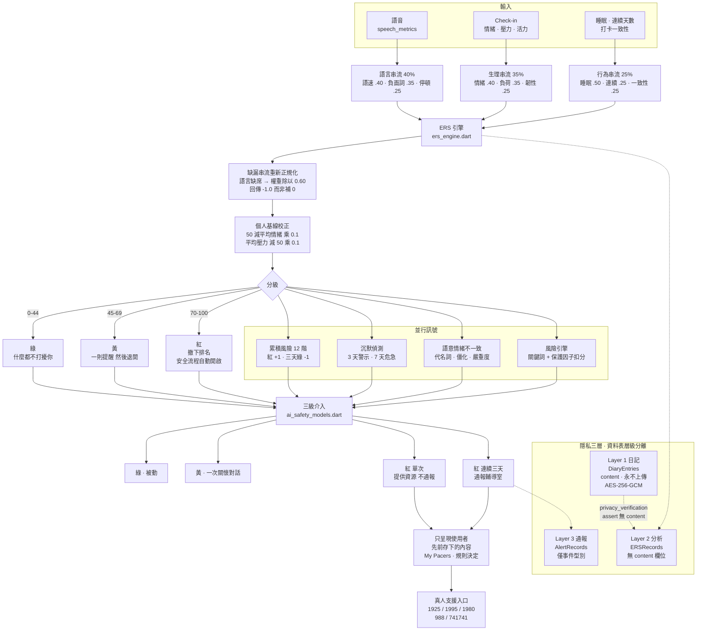

# lii

**主動介入、分級回應的 AI 情緒健康 App。**

*狀況越糟,lii 說得越少。*

**[▶ 線上試用](https://singular-croissant-c88834.netlify.app)** ｜ [English](README.md) ｜ [繁體中文](README.zh-TW.md)

> 網頁版可直接開啟試玩,無需安裝。AI 對話需自備 OpenAI 相容 API key(設定頁填入);未填時為離線模式、使用 demo 回覆,其餘功能皆可正常操作。
>
> **首次載入較慢,這是已知限制。** Flutter web 以 CanvasKit 渲染,需先下載數 MB 的引擎才能繪製第一個畫面。實測 7 日資料(n = 66 位獨立訪客,含日本、美國、台灣不同網路環境)FCP 的 p75 超過 3 秒,慢速網路下曾出現更長的單次峰值;載入完成後互動穩定,版面無位移(CLS 良好)。原生 iOS / Android 版本沒有這個問題。
>
> 網頁版亦缺少硬體級金鑰保護,最完整的保護在原生版本——此點在 App 的「關於與聲明」頁亦有明示。

---

## 請先看這裡 — 這個 repository 包含兩個版本

本 repository 已於 2026 年 8 月更名為 `lii`(原名 `PsyGuard-AI`),但兩個階段的完整開發歷史都保留在 commit 紀錄中。應用程式內的資料夾名稱 `psyguard_ai_app/` 維持不變,作為 v1 的歷史痕跡。

| | v1 — PsyGuard AI | v2 — lii |
|---|---|---|
| 期間 | 2026 年 4–5 月 | 2026 年 7 月 10 日至今 |
| 開發 | 四人學生團隊,指導老師侯凱鈞 | **由藍宥欣獨立迭代開發** |
| 範圍 | Flutter MVP:AI 陪伴聊天、每日 check-in、睡眠記錄、趨勢圖 | 三串流 ERS、三級介入、風險反向回應、三層隱私、加密日記、語音特徵、呼吸序曲 |
| 外部評價 | 第 23 屆育秀盃,2026 年 4 月 — 高中組 AI 應用佳作(75 件);苗豐強科技創新獎,714 件中取 3,由團隊與指導老師共同獲得 | 已送件達文西國際發明展,**結果尚未公布** |

兩階段之間有兩個月空白。**2026 年 7 月 10 日起的 55 個 commit 皆為作者本人的工作。**

v2 第一個 commit(`3ac57e1`,7/10)的 git 名稱顯示為 `olivia`,那是作者先前使用的 git 身分,已於同日在 `a4c26d8` 更正,此後皆以 `YuxinLan` 提交。

```bash
git shortlog -sn --all
git log --since=2026-07-10 --pretty=format:"%ad  %an  %s" --date=short
```

**規模**:`lib/` 約 32,900 行 Dart(不含產生檔);另有 14 個測試檔約 934 行,涵蓋 risk engine、資料庫、設定服務、匯出服務、四個頁面 widget test 與一個 integration test。

---

## 核心設計:風險越高,系統說得越少

一般身心健康 App 在使用者狀況變差時會變得更吵。lii 反過來——分數越高,系統越收斂自己的比較、建議與提示,把畫面交還給使用者先前存下的內容,並開啟通往真人的入口。

分級不是貼在學生身上的標籤,而是決定 App 被允許說多大聲。

---


---

## 架構圖




## ERS:情緒風險分數

`features/ers/ers_engine.dart` · `ers_models.dart`

三條串流,各自再有子權重。所有子項先經過階梯式標準化,轉成 10–90 的風險值:

| 串流 | 權重 | 子項與權重 |
|---|---|---|
| **語言** | 40% | 語速 0.40 · 負面詞密度 0.35 · 停頓頻率 0.25 |
| **生理** | 35% | 情緒穩定度 0.40 · 情緒輕鬆度 0.35 · 情緒韌性值 0.25 |
| **行為** | 25% | 睡眠時數 0.50 · 連續使用天數 0.25 · 打卡一致性 0.25 |

標準化不是線性映射,而是依區間切階。例如語速:低於 150 字/分視為嚴重偏慢(90),250–350 為正常(10),超過 400 視為焦慮性過快(60)——**兩端都是風險,中間才安全**。睡眠同理,超過 9 小時也計 25 分。

**缺漏串流重新正規化**(`hasVoice == false`):語言串流不列入,權重按 `0.35/0.60` 與 `0.25/0.60` 重新分配給生理與行為,`streamScores['language']` 回傳 `-1.0` 作為「未記錄」哨兵值,而不是補 0 或猜一個值。

**個人基線校正**:`(50 − 個人平均情緒) × 0.1 + (個人平均壓力 − 50) × 0.1`,最後 clamp 到 0–100。同一個分數對不同人代表不同意義。

**分級**:紅 ≥ 70、黃 ≥ 45、綠 < 45。

### 語言串流:一次被記錄下來的方法學修正

`core/ers/speech_metrics.dart` 檔頭直接寫明:語言串流原本是從壓力滑桿推算出來的假數據,等於壓力被重複計算兩次,三串流實際上只有兩個獨立訊號。這個檔案把它換成真的語音特徵——語速(字數 ÷ 說話秒數 × 60)、負面詞密度、停頓頻率。

同一份註解也寫明限制:手機語音辨識受環境音、口音、網路延遲影響,算出來的是粗估而非實驗室等級的聲學分析,適合當趨勢參考,不適合當單次診斷依據。

### 三級介入:通報需要「持續」,不是「一天」

`features/ai_safety/ai_safety_models.dart`

| 級別 | 條件 | 系統行為 |
|---|---|---|
| 綠 | — | 被動,不打斷 |
| 黃 | — | AI 主動發起一次關懷對話 |
| 紅(單次) | ERS ≥ 70 | 提供支援資源入口,**不通報** |
| 紅(持續) | ERS ≥ 70 **且連續 3 天** | 通報輔導室,`notifyCounselor = true` |

**一天很糟不會驚動大人。** 通報需要證據累積到三天,這是刻意設計的門檻——降低誤報對學生信任感的傷害。

### 累積風險:非對稱遲滯

`features/ers/cumulative_risk_engine.dart`

12 階刻度,各有顏色與標籤,中英各一套:

> 狀態良好 · 待觀察 · 輕微警示 · 需留意 · 請多關注自己 · 建議找人聊聊 · 持續關注中 · 積極介入 · 高度警戒 · 緊急 · 危機狀態 · 需立即協助

用詞刻意由描述狀態逐步轉為建議行動——前段講「觀察」,中段講「找人聊聊」,後段才講「介入」。。升降不對稱:

- 一天紅燈,紅燈計數 **+1**
- 要**連續三天綠燈**,計數才 **−1**

每個日曆日只更新一次。系統偏向「寧可多留意」,而不是一天好轉就撤除關注。

### 沉默偵測

`features/ers/silence_detector.dart`

不寫東西本身就是訊號。連續 3 天未活動為 warning、7 天為 critical,同一天最多提醒一次。

### 語意—情緒不一致偵測

`features/ers/incongruence_detector.dart`

偵測冷靜語氣下的隱藏危機,四個面向:代名詞密度(中文「我」/ 英文 I、me、my)、認知僵化標記(一定、必須、絕對 / always、never、impossible)、事件嚴重度關鍵詞、低情緒強度詞彙。當敘述的事件很嚴重、但情緒表達很平淡,兩者的落差本身就是訊號。

### 風險引擎:與 ERS 分開的第二層

`core/risk_engine/risk_engine.dart`

ERS 算趨勢分數;RiskEngine 處理當下訊號,中英雙語關鍵詞比對,並回傳**可解釋的理由清單**。

**保護因子會扣分**:

| 訊號 | 分數 |
|---|---|
| 近期持續完成自助工具(7 天內 ≥3 次) | **−10** |
| 訊息中出現求助意願 | **−10** |
| 睡眠困難近期回穩 | **−5** |
| 近 3 天情緒平均較 14 天平均低 20 分以上 | +10 |
| 拒學/無助訊號累積 ≥3 次 | +20 |

求助意願會降低風險評分——**一個願意開口的人,處境跟一個沉默的人不一樣。**

---

## 安全流程

`core/safety/safety_flow_service.dart` · `features/safety/presentation/safety_page.dart`

依風險等級給出不同步驟,中英各一套。高風險從 **Step 0(先確保立即安全)** 開始,再依序穩定呼吸、選擇一位真人、整理求助訊息。

`core/network/ai_local_messages.dart` 準備了離線與高風險時的本機回覆——即使連不上伺服器,使用者拿到的仍是呼吸指引與求助專線,而不是一則錯誤訊息。

`core/widgets/micro_shake.dart` 在風險極高時讓求助按鈕產生持續細微搖晃,引導注意。

---

## 隱私:三層,在資料表層級分離

`features/privacy/privacy_database.dart` 定義三張 Drift 資料表:

| 層 | 資料表 | 欄位 |
|---|---|---|
| Layer 1 · 日記層 | `DiaryEntries` | `id`、`content`、`createdAt` — **本地,永遠不上傳** |
| Layer 2 · 分析層 | `ERSRecords` | `anonymousId`、`ersScore`、`riskLevel`、三串流分數、`date` — **沒有 content 欄位** |
| Layer 3 · 通報層 | `AlertRecords` | `anonymousId`、`alertType`、`triggeredAt`、`counselorNotified` — 只在 Safety Flow 啟動時使用 |

分離發生在 schema 層,不是權限設定層:分析表**結構上就沒有**日記內容的欄位。

`privacy_verification.dart` 用 assert 驗證這件事——把「日記不會外流」寫成一條可執行的檢查,而不只是文件承諾。

`privacy_models.dart` 定義三個存取層級(`studentOnly` / `counselorStats` / `adminAlert`),且同意權限是**分開的**:同意輔導老師查看統計、與同意紅燈時通報輔導室,是兩個獨立開關。

### 秘密日記的加密

`core/security/secret_diary_lock.dart`

同一把 AES 金鑰,三種取得方式:App 密碼(PBKDF2 推導,解開包住金鑰的信封)、Touch ID(從 Keychain 取出)、復原碼。

檔頭寫明:**三條路全失效 = 秘密日記救不回來,這是設計本質。**

PBKDF2 迭代次數為 30,000,並附理由:Web 版編譯成單執行緒 JS,12 萬次會凍住畫面數秒;3 萬次快四倍、體感順很多。一個被記錄在原處的安全性與可用性取捨。

`secret_swipe_shell.dart` 是隱藏入口——向左滑時顏色跟著手指褪到 75% 飽和度,露出秘密頁。

### 秘密層:一整套平行的筆記與月曆

`core/security/secret_swipe_shell.dart` · `secret_diary_lock.dart` ·
`features/checkin/presentation/note_page.dart` · `month_overview_page.dart`

秘密內容不是日記裡的一個資料夾,而是**與公開版並存的一整層**。`SecretSwipeShell` 同時包住筆記頁與年度月曆:

```dart
SecretSwipeShell(
  publicPage: MonthOverviewPage(),
  secretPage: MonthOverviewPage(secret: true),
)
```

向左滑,顏色跟著手指褪到 75% 飽和度,底下就是同一頁的秘密版本。

| | 公開層 | 秘密層 |
|---|---|---|
| 儲存鍵 | `note_YYYY_M_D` | `secret_note_YYYY_M_D` |
| 內容 | 明文 | `encryptContent()` / `decryptContent()` · AES-256-GCM |
| 配色 | 淺藍 | 芋頭紫 — 一眼就知道現在在哪一層 |
| 年度月曆 | 彙整公開筆記 | 只彙整秘密筆記,需先解鎖 |
| 進出 | — | 進入時 `cancelPendingLock()`,離開時 `scheduleLock()` |

**解鎖三條路**:生物辨識(提示語「解鎖秘密日記」)、App 密碼(PBKDF2 推導)、復原碼。

**復原碼只顯示一次。** 畫面上直接寫著:如果忘記密碼,這是唯一回到秘密日記的方法,請寫在紙上收好,這個畫面只會出現這一次。首次使用有獨立的「建立秘密日記」流程;未解鎖時顯示鎖定畫面而非空白頁。

離開時何時清掉記憶體中的金鑰,由設定頁那三個自動上鎖選項決定(離開就鎖 / 2 分鐘後 / 關閉 App 才鎖)。


### 對存取控制的誠實聲明

`core/config/access_gate.dart` 檔頭:「這是一道門,不是一把鎖。Flutter web build 是純前端,key 就在 JS 檔裡,開 devtools 搜尋就找得到……要真正保護 key 只有一條路:後端代理,key 留在伺服器。」

同樣的態度也出現在使用者看得到的地方。`/about` 頁面的隱私段落結尾直接寫著:網頁版缺少硬體級保護,最強的保護在原生 iOS / Android 版本,網頁版適合展示與試用。**限制不只寫在註解裡,也寫在使用者讀得到的頁面上。**

---

## My Pacers 與呼吸序曲

`core/pacer/breath_plan.dart`(317 行純邏輯,不 import flutter,可獨立測試)

核心概念是「序曲」:**不能把一個正在焦慮的人直接丟進 4-7-8**。他現在一分鐘呼吸 18 次,開場就要他停 7 秒等於憋不過去,只會更慌然後關掉 App。所以從他當下的速度起步,再逐段拉慢。四階段:overture → ramp → main → outro。

`core/widgets/lii_breath_entry.dart` 的觸發規則**沿用 `risk_engine` 既有門檻,不另外發明**——同一套風險定義貫穿全 App。

`core/pacer/bookmark_quick_add.dart` 讓使用者在平穩的日子存下一句話、一個人、一個轉捩點。`features/bookmark/presentation/bookmark_page.dart`(Pacer Lift,1,650 行)分兩個分頁:語錄纜車(別人對你說的話,標記誰說的)與觀景台成就。`core/widgets/floating_pacer.dart` 依 author 分組呈現,一鍵可刪。

**由規則決定哪一則 Pacer 出現,不由生成式模型決定使用者聽到什麼。**

### 水晶收集

`core/crystals/crystal_store.dart` 檔頭:「只能靠呼吸取得。不是課金也不是隨機抽——每一顆都對應一件他真的做過的事。」取得條件明列在 `kCrystalRules`(完成 N 次呼吸或連續 N 天)。

收藏頁的設計理由也寫在註解裡:已取得的會自己呼吸,未取得的是暗的但形狀看得見——**看得見才會想要,全黑的格子只會讓人覺得反正拿不到。**

概念基礎為認知治療中的 hope box;其數位版本曾在 118 位退伍軍人的隨機分派試驗中測試(Bush et al., *Psychiatric Services*, 2017),結果顯示因應自我效能提升。

---

## Hey Luna:拿掉規劃這一步

`features/voice/voice_wake_service.dart` · `voice_wake_page.dart`

所有待辦 App 都問「你希望什麼時候被提醒?」——這個問題假設學生還有能力規劃。lii 改成詢問**優先度**,而且用說的,提前天數由系統依分級計算。

實作上處理過兩個具體問題,註解都有記錄:語音辨識的部分結果會讓 `onResult` 連續觸發、導致喚醒詞重複回應,以旗標確保單次聆聽只觸發一次;iOS 預設音訊類別在靜音開關開啟時不發聲,需設為 `playback`。

筆記與待辦在 `features/checkin/presentation/note_page.dart`(15 級優先度),年度總覽在 `month_overview_page.dart`。

---

## CBT 與工具

`core/cbt/cbt_service.dart` 針對青少年最常見的 6 種認知扭曲:非黑即白、過度類化、妄下結論、情緒化推理、災難化、貼標籤。AI 未設定時有 fallback 保底。

`features/cbt/presentation/cbt_page.dart` 是 5 步驟練習,由寵物引導,**練習前後各做一次情緒評分**。

`features/quiz/presentation/distortion_quiz_page.dart` 是 12 題測驗(6 種扭曲各 2 題),算出最容易掉進哪種思考陷阱,附說明與練習建議。

`features/tools_library/` 是工具庫與使用紀錄。

臨床文獻標註為設計依據,不作為治療宣稱。

---

## 團體基準線

`core/ers/group_norms.dart` 依年齡層(12 歲以下 / 13–15 / 16–18 / 18 以上)提供對比常模。檔頭明確標注:**目前是研究常模估計值,不是真實使用者資料,UI 上一定要標注「基於研究常模」。** 後端接口已預留,未來接匿名資料庫時只需改寫 `fetch()`,呼叫端不用動。

---

## 幾個被記錄下來的工程判斷

- **潮聲用 Dart 即時合成**(`core/audio/tide_sound.dart`)——不用音檔,零素材、零授權問題,也不必把好幾 MB 的 mp3 打包進 App。
- **那顆球全部用 Gradient + Path**(`core/widgets/lii_orb.dart`、`luna_orb.dart`)——不使用任何模糊或發光濾鏡,因為濾鏡在 Flutter web 上要嘛沒對應、要嘛掉幀,漸層與路徑則是一對一。
- **風險的非數字表示**(`core/widgets/geometric_stress_indicator.dart`)——低風險是中空圓形、中風險是半填充正方形,以形狀而非數字傳達狀態。
- **呼吸環頻率跟著風險走**(`core/widgets/breathing_ring.dart`)——冷靜 3 秒週期、留意 2 秒、焦慮 1 秒。
- **儀表板與每日鼓勵語只讀本機資料**(`features/dashboard/`、`features/home/presentation/encouragement_banner.dart`)——不呼叫 AI,零成本、離線可用。
- **API 用量透明化**(`features/api_usage/`)——顯示個人 key 的估算用量與花費,並註明 token 依文字長度估算、實際以供應商帳單為準。
- **使用統計全部留在本機**(`core/analytics/usage_tracker.dart`)——記錄每頁開啟次數與停留秒數供研究用,不上傳。

---

## 氛圍系統:八種節慶與季節主題

`core/theme/mood_theme_service.dart` · `core/widgets/mood_fall_overlay.dart`

八種氛圍加上「無氛圍」預設值。每一種都同時決定底色、飄落粒子與首頁角落的吉祥物:

| 氛圍 | 底色 | 飄落效果 | 首頁角落 |
|---|---|---|---|
| 🎄 聖誕節 | `#FFFBF5` 極淺米白 | 雪 | 掛飾裡的貓 |
| 🧧 過年 | `#FFF3F3` 極淺粉紅 | 煙火 | 小龍賀歲 + 紅包噴灑 |
| 🌸 春 | `#FCE4EC` 粉嫩 | 花瓣 | 復活節兔兔 |
| ☀️ 夏 | `#E0F7FA` 明亮淺藍 | 水花 | 海灘上的墨鏡貓與兔兔 |
| 🍁 秋 | `#FBE9E0` 橘棕暖調 | 落葉 | 搖擺吉祥物 |
| ❄️ 冬 | `#E8F0F7` 冷藍白 | 雪 | 工程師企鵝 → 孵蛋 → 冰屋 |
| 🧣 寒假 | `#F3E9E0` 暖米色 | 雪 | 一起堆雪人 |
| 🏖️ 暑假 | `#FFF3D6` 活潑亮黃 | 零食 | 排球男孩 + 飲料吧 |
| — 無氛圍 | 透明 | 無 | 空位 |

**氛圍底色的優先權高於深淺模式**;但在深色模式下不會換成另一組顏色,而是 `Color.lerp(底色, #14161B, 0.85)`——**保留色相、整體壓暗**,所以春天在夜裡仍然是春天的粉。

各氛圍對應的互動元件散在 `core/widgets/`:`snow_cap.dart`(積雪計數,每點一次球球就 +1)、`frost_touch_layer.dart`(手碰到哪就從那裡結晶擴散,用 translucent 只觀察觸碰、不消費手勢,所以不擋按鈕)、`hongbao_layer.dart`(點紅包開出隨機金額並從該位置噴灑,疊層用 `IgnorePointer` 不擋互動)、`paw_tap.dart`(聖誕時貓掌拍在點擊處留下掌印,鍵盤開啟時暫停以免打擾寫字)、`penguin_nest.dart`(企鵝生蛋,滿巢後孵化)、`beach_corner.dart` 與 `fish_pond.dart`(魚可拖曳撈起、Angry Birds 式投籃並顯示軌跡預測)、`hoop_corner.dart`(畫面與物理共用同一組比例,避免「看起來進了卻沒算分」)。

`floating_app_brand.dart` 的飄浮 lii 球長按即可叫出氛圍選單,`mood_fall_overlay.dart` 是全 App 共用的飄落控制器,呼叫一次播放一次。

---

## 完整功能地圖

31 條路由,側邊導覽分為六組。

### Daily · 每日

| 頁面 | 內容 |
|---|---|
| Dashboard | 一頁看完 ERS、連續天數、規律性、筆記數與近期趨勢——**只讀本機資料,不呼叫 AI** |
| Check-in | 頁面名為「筆記紀錄」。情緒穩定度、情緒輕鬆度、情緒韌性值三支滑桿(0–100%,越高越好)+ 今日筆記;儲存後 ERS 卡自動展開。另有歷史頁 |
| Sleep Log | 睡眠時長、入睡困難度、就寢時間與起床時間。另有歷史頁 |
| Trends | 7/14/30 日趨勢拉桿、個人與團體對比、研究基準線 |
| Calendar | 年度重點總覽月曆,紅黃事項依週彙整。**向左滑可切換到需解鎖的秘密月曆** |
| Silence check · 沉默偵測 | 三天沒有紀錄,學生下次自己打開時會被問一句現況,點一下直接進三個拉桿。沒有推播、沒有連續紀錄、不顯示天數。不理它,八秒後自己消失 |
| Silence check · 沉默偵測 | 三天沒有紀錄,學生下次自己打開時會被問一句現況,點一下直接進三個拉桿。沒有推播、沒有連續紀錄、不顯示天數。不理它,八秒後自己消失 |
| Silence check · 沉默偵測 | 三天沒有紀錄,學生下次自己打開時會被問一句現況,點一下直接進三個拉桿。沒有推播、沒有連續紀錄、不顯示天數。不理它,八秒後自己消失 |

### Practice · 練習

| 頁面 | 內容 |
|---|---|
| Talk it out · 說出來 | 文字對話,含上下文記憶與舊訊息壓縮摘要 |
| Thought Coach | 5 步驟 CBT 練習,寵物引導,**練習前後各評一次情緒** |
| Thinking Trap Quiz | 12 題測驗(6 種認知扭曲各 2 題),附結果說明與練習建議 |
| Toolbox | 心理工具箱,四個工具:自我對話卡、4-7-8 呼吸、5-4-3-2-1 著地、情緒詞彙庫;含練習紀錄 |

### 其他功能

| 頁面 | 內容 |
|---|---|
| Hope Box | 8 種情境(深呼吸、低落、不孤單、休息、對自己好、深夜、你可以的、我的),35 張卡。點一下翻面、左右滑換卡、♡ 收藏、可自己寫。中英嚴格分開,不混語 |
| My Pacers | Pacer Lift:語錄纜車(標記誰說的)＋觀景台成就里程碑 |
| Weekly Persona | 依當週實際的心情/壓力/活力記錄自動算出六隻動物之一(水獺、水豚、烏龜、松鼠、熊、蝴蝶)。**不用做題** |

首頁另有可拖曳的 Luna Pacer 浮球(夜空與玻璃兩面,可左右滑動轉面),以及水晶收藏:6 顆,ice 起始、sea 3 次呼吸、amethyst 7 次、amber 14 次、moss 連續 3 天、dawn 連續 7 天,系統會提示下一顆還差多少。

### Reports · 報告

| 頁面 | 內容 |
|---|---|
| AI Report · AI History | AI 生成的趨勢報告與歷史紀錄 |
| API Usage | 個人 API key 的估算用量與花費(可自訂單價),註明 token 依文字長度估算、以供應商帳單為準 |

### More · 其他

| 頁面 | 內容 |
|---|---|
| Safety Flow | 分級感知安全流程與真人服務專線 |
| Voice | 「Hey Luna」喚醒詞語音筆記,語音特徵同時餵進 ERS 語言串流 |
| Export Report | 身心報告匯出:JSON 或 PNG,可選天數區間(含 7 日快捷) |
| Settings | 見下節 |
| About & Statement | **隱私與安全**:本機優先、AES-256-GCM 認證加密、信封加密金鑰、PBKDF2 推導、金鑰只在需要時載入記憶體並依設定自動清除、API 金鑰存於 Keychain / Secure Enclave / Keystore;並直接寫明網頁版缺少硬體級保護,最強的保護在原生版本。**使用聲明**:不取代專業醫療、諮商或危機處理;ERS 為參考性指標,非臨床診斷。**授權與致謝**:列出所用開源套件,各依其原始授權條款。頁尾一句:青少年的心理資料,值得最高規格的保護 |

### 首頁

問候語與明暗切換、四張可左右翻的狀態卡(首張為當日 well-being),接著兩區卡片:**Explore Yourself · 探索自己**(Check-in、Trends、Talk it out、Sleep Log、Year Overview、My Quote Cards)與 **Tools · 工具**(Toolbox、Export、Thought Coach、Thinking Traps、Weekly Persona、Hope Box、My Pacers、Hey Luna)。

### 設定頁

| 區塊 | 內容 |
|---|---|
| 年齡層 | 12 歲以下 / 13–15 / 16–18 / 18 以上,用於與同齡研究常模對比 |
| 字級 | S / M / L / XL |
| **Daily Pacer** | 「每天帶回一句」開關——Luna 每天取回一則先前存下的話 |
| 語言 | 中英切換,即時生效 |
| **AI 狀態** | 未設定 key 時明白顯示「離線模式,目前使用 demo 回覆」——**不假裝在運作** |
| AI 設定 | OpenAI 相容 Base URL、API key、模型名稱,使用者自備 |
| 語音 | 朗讀速度滑桿 |
| **資料與隱私** | 明示資料存於本機 SQLite、可隨時清除;並明示若自行設定 API key,對話內容可能送往第三方 AI 服務 |
| **秘密日記自動上鎖** | 三選一,並直接標明代價:離開就鎖(最安全,每次都要解)/ 2 分鐘後鎖(短暫離開不用重解)/ 關閉 App 才鎖(最方便,最不隱私) |
| 清除本機資料 | 刪除所有對話、筆記、睡眠記錄、趨勢、AI 報告與設定(含同意狀態),不可復原 |

自動上鎖那組選項值得單獨一提:**它沒有替使用者決定安全與便利之間的平衡,而是把三個選項連同各自的代價一起寫出來,讓使用者自己選。** 這與整個 App 的態度一致——揭露限制,而不是隱藏它。

---

## 其餘實作細節

**AI 對話層** — `core/network/`:`ai_api_client.dart`、`ai_chat_repository.dart`(660 行,含上下文記憶與摘要壓縮)、`ai_error_formatter.dart`、`app_config_controller.dart`、`dio_provider.dart`。

**儲存** — `core/storage/app_database.dart`(Drift,531 行)搭配 native 與 web 兩種 executor,同一份 schema 跨平台。local-first,預設不上傳。

**其他** — `core/data/quotes_data.dart`(每日語錄庫,中英雙語並記錄出處)、`core/settings/font_scale_provider.dart`(字級)、`core/widgets/tooltip_bubble.dart`(長按功能說明氣泡)、`core/widgets/brand_loading_indicator.dart`(以 logo 緩慢縮放取代 CircularProgressIndicator)、`lib/l10n/`(中英雙語字串)。

---


---

## 專案結構

```
lii/
├── README.md
├── README.zh-TW.md
├── LICENSE
├── AGENTS.md
└── psyguard_ai_app/
    ├── pubspec.yaml
    ├── test/                                   14 個測試檔 · 934 行
    │   ├── config/
    │   │   ├── android_manifest_test.dart
    │   │   └── web_assets_test.dart
    │   ├── core/
    │   │   ├── ai_chat_repository_test.dart
    │   │   ├── app_config_controller_test.dart
    │   │   ├── app_database_test.dart
    │   │   ├── local_settings_service_test.dart
    │   │   ├── risk_engine_test.dart
    │   │   └── summary_export_service_test.dart
    │   ├── widget/
    │   │   ├── checkin_page_test.dart
    │   │   ├── home_page_test.dart
    │   │   ├── safety_page_test.dart
    │   │   └── trends_page_test.dart
    │   └── widget_test.dart
    ├── integration_test/
    │   └── app_flow_test.dart
    └── lib/                                    約 32,900 行
        ├── main.dart
        ├── app/
        │   ├── app.dart
        │   ├── router.dart                     31 條路由
        │   └── theme.dart
        ├── l10n/
        │   ├── app_language.dart
        │   ├── app_strings.dart
        │   └── strings_zh_tw.dart
        ├── core/                               ← 跨頁面共用的引擎與服務
        │   ├── ers/
        │   │   ├── speech_metrics.dart         語音特徵：語速 · 負面詞 · 停頓
        │   │   └── group_norms.dart            年齡層與研究常模（非真實使用者資料）
        │   ├── risk_engine/
        │   │   ├── risk_engine.dart            關鍵詞 + 保護因子扣分 + 可解釋理由
        │   │   ├── risk_models.dart
        │   │   └── risk_provider.dart
        │   ├── safety/
        │   │   ├── safety_flow_service.dart    分級對應的步驟序列
        │   │   └── safety_models.dart
        │   ├── security/
        │   │   ├── secret_diary_lock.dart      AES-256-GCM · PBKDF2 · 三條解鎖路徑
        │   │   ├── secret_swipe_shell.dart     滑動露出秘密頁
        │   │   └── local_settings_service.dart
        │   ├── pacer/
        │   │   ├── breath_plan.dart            呼吸序曲 · 純邏輯 · 不 import flutter
        │   │   └── bookmark_quick_add.dart
        │   ├── crystals/
        │   │   ├── crystal_store.dart          6 顆 · 只能靠呼吸取得
        │   │   └── crystal_collection_page.dart
        │   ├── cbt/
        │   │   └── cbt_service.dart            6 種認知扭曲
        │   ├── network/
        │   │   ├── ai_api_client.dart
        │   │   ├── ai_chat_repository.dart     上下文記憶 + 舊訊息壓縮
        │   │   ├── ai_error_formatter.dart
        │   │   ├── ai_local_messages.dart      離線與高風險的本機回覆
        │   │   ├── app_config_controller.dart
        │   │   └── dio_provider.dart
        │   ├── storage/
        │   │   ├── app_database.dart           Drift schema
        │   │   ├── app_database_executor_native.dart
        │   │   ├── app_database_executor_web.dart
        │   │   ├── app_database_executor.dart
        │   │   └── database_provider.dart
        │   ├── theme/
        │   │   ├── mood_theme_service.dart     8 種氛圍主題
        │   │   ├── background_theme_service.dart
        │   │   └── app_theme.dart
        │   ├── audio/
        │   │   └── tide_sound.dart             Dart 即時合成 · 無音檔
        │   ├── analytics/
        │   │   ├── usage_tracker.dart          僅存本機
        │   │   └── usage_stats_page.dart
        │   ├── export/
        │   │   ├── summary_export_service.dart
        │   │   └── export_models.dart
        │   ├── config/
        │   │   ├── access_gate.dart            「一道門，不是一把鎖」
        │   │   └── app_config.dart
        │   ├── data/
        │   │   ├── quotes_data.dart
        │   │   └── mock_data_seeder.dart
        │   ├── settings/
        │   │   └── font_scale_provider.dart
        │   └── widgets/                        25 個元件
        │       ├── lii_orb.dart                Gradient + Path · 不用濾鏡
        │       ├── luna_orb.dart
        │       ├── luna_pacer_card.dart
        │       ├── floating_pacer.dart         依 author 分組
        │       ├── lii_breath_entry.dart       沿用 risk_engine 門檻
        │       ├── lii_breath_page.dart
        │       ├── breathing_ring.dart         3 / 2 / 1 秒依風險
        │       ├── starry_breath.dart
        │       ├── geometric_stress_indicator.dart  風險 → 幾何形狀
        │       ├── micro_shake.dart            極高風險時引導注意
        │       ├── mood_fall_overlay.dart      飄落控制器
        │       ├── snow_cap.dart               積雪
        │       ├── frost_touch_layer.dart      不消費手勢
        │       ├── hongbao_layer.dart          IgnorePointer
        │       ├── paw_tap.dart                鍵盤開啟時暫停
        │       ├── penguin_nest.dart           孵蛋
        │       ├── beach_corner.dart
        │       ├── fish_pond.dart
        │       ├── hoop_corner.dart            畫面與物理共用比例
        │       ├── flowing_water.dart
        │       ├── pet_reminder_bubble.dart
        │       ├── floating_app_brand.dart     長按叫出氛圍選單
        │       ├── app_brand_icon.dart
        │       ├── brand_loading_indicator.dart
        │       └── tooltip_bubble.dart
        └── features/                           ← 以頁面為單位
            ├── ers/
            │   ├── ers_engine.dart             三串流加權 · 缺漏重新正規化
            │   ├── ers_models.dart
            │   ├── cumulative_risk_engine.dart 12 階 · 非對稱遲滯
            │   ├── silence_detector.dart       3 天 / 7 天
            │   ├── incongruence_detector.dart  語意情緒不一致
            │   ├── ers_percentile_widget.dart  紅燈時撤下
            │   └── ers_test.dart
            ├── ai_safety/
            │   └── ai_safety_models.dart       三級介入 · 通報需連續三天
            ├── privacy/
            │   ├── privacy_database.dart       三張表 · 結構上分離
            │   ├── privacy_models.dart         三個存取層級
            │   └── privacy_verification.dart   assert：ERS 表無 content
            ├── safety/presentation/
            │   └── safety_page.dart
            ├── home/presentation/
            │   ├── home_page.dart
            │   └── encouragement_banner.dart   不呼叫 AI
            ├── dashboard/presentation/
            │   └── dashboard_page.dart         只讀本機資料
            ├── checkin/presentation/
            │   ├── checkin_page.dart
            │   ├── checkin_history_page.dart
            │   ├── month_overview_page.dart
            │   └── note_page.dart              15 級優先度
            ├── sleep/presentation/
            │   ├── sleep_page.dart
            │   └── sleep_history_page.dart
            ├── trends/presentation/
            │   ├── trends_page.dart
            │   ├── ai_report_page.dart
            │   └── ai_report_history_page.dart
            ├── chat/presentation/
            │   └── chat_page.dart
            ├── voice/
            │   ├── voice_wake_service.dart     喚醒詞去重 · iOS 音訊類別
            │   └── voice_wake_page.dart
            ├── cbt/presentation/
            │   └── cbt_page.dart               5 步驟 · 前後各評一次情緒
            ├── quiz/presentation/
            │   └── distortion_quiz_page.dart   12 題
            ├── tools_library/presentation/
            │   ├── tools_page.dart             4 個工具
            │   └── tool_history_page.dart
            ├── hopebox/presentation/
            │   └── hope_box_page.dart          8 情境 · 35 張卡
            ├── bookmark/presentation/
            │   └── bookmark_page.dart          Pacer Lift · 語錄纜車 + 觀景台
            ├── card_studio/presentation/
            │   ├── card_studio_page.dart
            │   ├── my_cards_page.dart
            │   └── my_cards_store.dart
            ├── persona/presentation/
            │   └── persona_page.dart           6 隻動物 · 不用做題
            ├── welcome/presentation/
            │   ├── welcome_page.dart
            │   └── consent_page.dart           分項授權
            ├── onboarding/
            │   └── onboarding_guide.dart       4 張卡 · 只跳一次
            ├── settings/presentation/
            │   └── settings_page.dart
            ├── export/presentation/
            │   └── export_page.dart            JSON / PNG
            ├── api_usage/presentation/
            │   └── api_usage_page.dart
            ├── about/presentation/
            │   └── about_page.dart
            └── shared/
                └── app_frame.dart
```


---


---

## 外部驗證與成果

### 第 23 屆育秀盃創意獎（2026 年 4 月）

v1 PsyGuard AI 以「心靈守衛隊」四人團隊參賽,指導老師侯凱鈞,獲得兩項:

| 獎項 | 範圍 |
|---|---|
| **高中職組 AI 應用類 佳作** | 該類別 75 件參賽作品 |
| **苗豐強科技創新獎** | **全賽事 714 件作品跨類別評選,僅 3 件獲獎**;由團隊與指導老師共同獲頒 |

苗豐強科技創新獎不分組別、就全體參賽作品評選,714 取 3。這是 lii 目前最強的第三方外部驗證,也是 v1 階段的成果——**v2 lii 由作者獨立迭代開發,尚未有對應的獎項結果**。

### 達文西國際發明展（2026 年 8 月送件）

v2 lii 以個人作品送件,**結果尚未公布**。本文件不將任何預期結果寫為已完成。

### 教育局行政指導（2026 年 4 月）

見下節「外部法規對照」。屬建議性質,不構成背書。

### 兩次小規模試用（2026 年 7 月、8 月）

見下節「試用結果」。**兩次都不是 validation**,限制已逐項列出。


## 外部法規對照

2026 年 4 月 17 日,團隊就本作品**入圍第 23 屆育秀盃全國決賽**一事,去函臺中市政府請求教育局提供書面建議。4 月 23 日由**教育局／學生事務室**具名回覆(案件編號 115-E018647,府收文號 1150123154,承辦人江雯樺)。

回覆分兩部分:法規面與校園實務執行面。以下為原文重點與 lii 的對應設計。**該回覆為建議性質、供團隊參酌,不構成背書、認證或核可。**

> 需要說明的是:這份公文取得於 v1 PsyGuard 團隊階段,由團隊具名請求。v2 lii 為作者後續獨立迭代開發,設計上沿用了同一份法規對照,並在此基礎上加深(例如把「分層授權」實作成三張結構分離的資料表、把「避免標籤化」實作成紅燈時撤下排名)。

### 一、法規面

| 法規 | 重點 | lii 的對應 |
|---|---|---|
| 個人資料保護法 | 心理健康資料屬特種個資,蒐集、處理與利用需告知並取得書面同意 | 啟動時同意流程;逐項授權(輔導老師查看統計、紅燈通報)分開,且可隨時撤回 |
| 兒童及少年福利與權益保障法 | 嚴防識別資訊外洩;預警機制須符合兒少最佳利益,並避免標籤化與不當處置 | 紅燈時撤下排名與比較;老師端只看到一個去識別化數字,看不到日記任何一行 |
| 學生輔導法 | 遵守輔導倫理與資安標準:傳輸與儲存安全、專業保密、資安分級 | 日記於裝置端 AES-256-GCM 加密,金鑰僅存於 Keychain / Secure Enclave / Keystore,不離開手機 |

### 二、校園實務執行面

回覆指出系統設計應契合「臺中市校園學生自我傷害三級預防工作計畫」之架構。lii 的三個分級即依此對照設計:

lii 的三個分級並非自行發明,而是對照市府三級預防架構設計:

| 市府架構 | 內容 | lii |
|---|---|---|
| **初級預防** | 生命教育與情緒覺察,協助學生自我照顧、協助校園守門人辨識風險 | **綠** — 什麼都不打擾你 |
| **次級預防** | 高關懷學生早期預警,維護隱私,由輔導人員及時介入 | **黃** — 一則提醒,然後退開 |
| **三級預防** | 整合危機處理與通報、追蹤個案、連結外部醫療或社福資源 | **紅** — 安全流程自動開啟,並提供真人服務專線 |


## 適用範圍聲明

> lii 是情緒陪伴與身心健康支持產品,並非醫療器材。它不診斷、不治療、不預防任何疾病,也不取代專業照護。文中引用的臨床文獻(包含 CBT 相關內容)是作為設計依據,而非治療宣稱。

安全頁提供的真人服務專線:台灣 1925 / 1995 / 1980;美國 988 / 741741。

---

## 試用結果 — 以及它不是什麼

| | 2026 年 7 月 | 2026 年 8 月 3–4 日 |
|---|---|---|
| 參與者 | 18 位學生,單次引導 session | 17 份回應,13 份可用 |
| 啟用串流 | 兩個(語言流未啟用) | **三個** — 語言首次進入分數 |
| 分級分布 | 綠 12、黃 5、紅 1 | 綠 9、黃 4、紅 0 |

**兩次都不是 validation。** 單次 session;n = 13–18;樣本為自選,八月那次未受監督;子分數是從 App 讀出而非獨立量測;沒有獨立情緒量表;權重是設計選擇而非驗證過的係數。八月沒有出現紅燈,因此紅燈時的克制行為仍未被測試。

七月那次改變了什麼:18 人中有 2 人認為回返的 Pacer 可能讓情況更糟——因此現在每則 Pacer 都可一鍵關閉。另外 16 人中有 3 人想不出要寫什麼;冷啟動問題真實存在,尚未解決。

---

## 目前狀態

- **達文西國際發明展** — 已送件,結果尚未公布。
- **專利** — 台灣發明專利,申請書撰擬中,**尚未提出申請**。
- 外部意見 — 臺中市政府教育局,文號 115-E018647,2026 年 4 月 23 日,回覆作者之詢問。屬諮詢性質意見,非背書。

## 技術架構

Flutter · Riverpod · GoRouter · Drift + SQLite · Dio ·
`speech_to_text` / `flutter_tts` · `encrypt` + `pointycastle` · `flutter_secure_storage` ·
OpenAI 相容 chat API · iOS 與 Android · 繁體中文與英文 · local-first 儲存

## 本地執行

```bash
cd psyguard_ai_app
flutter pub get
dart run build_runner build --delete-conflicting-outputs
flutter analyze
flutter test
```

環境變數請放在 `psyguard_ai_app/.env`(可參考 `.env.example`):

```
API_BASE_URL=https://api.openai.com
API_KEY=your_api_key
AI_MODEL=gpt-4o-mini
APP_ENV=dev
```

## 作者

藍宥欣 · 臺中市新民高級中學

## 授權

MIT — 見 [LICENSE](LICENSE)。
